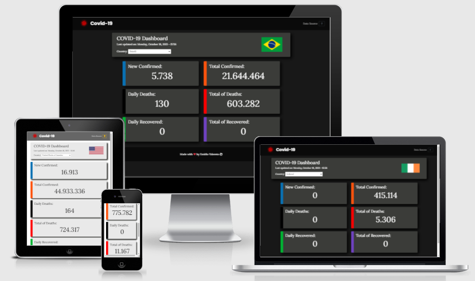
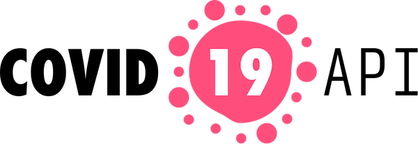
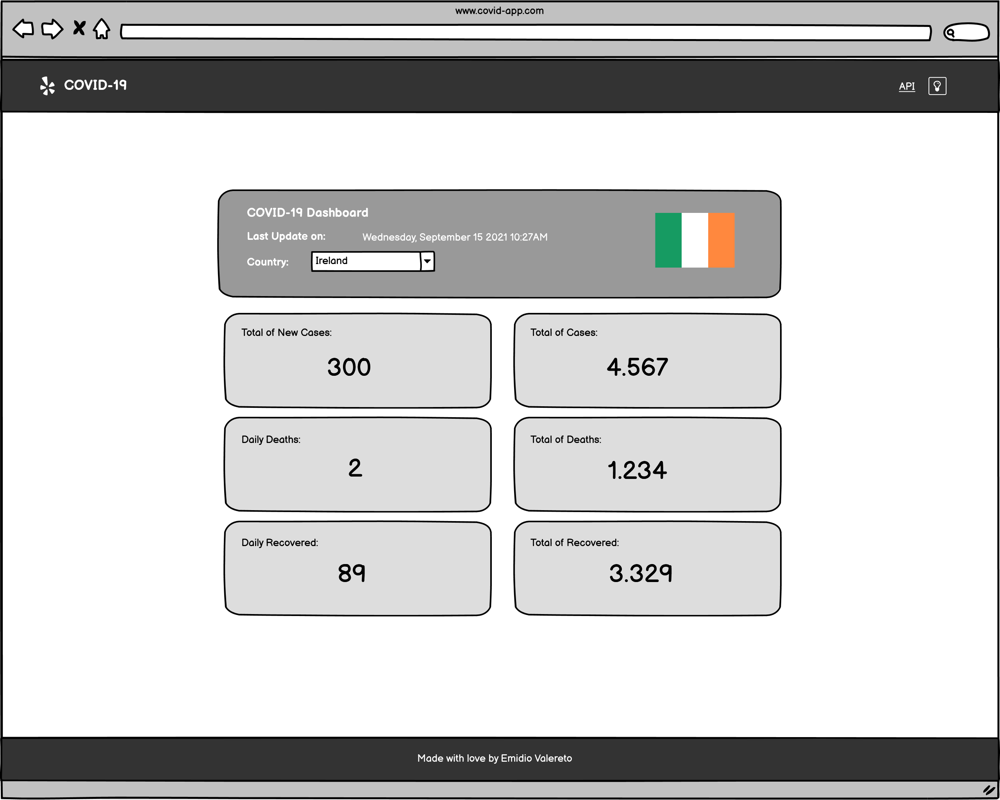
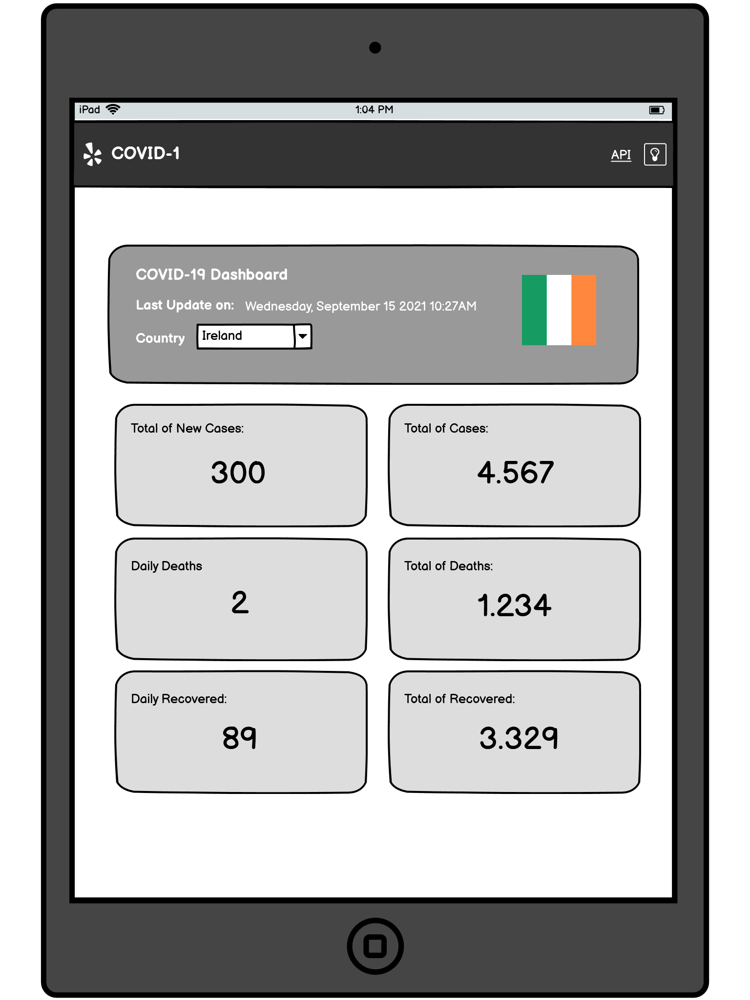
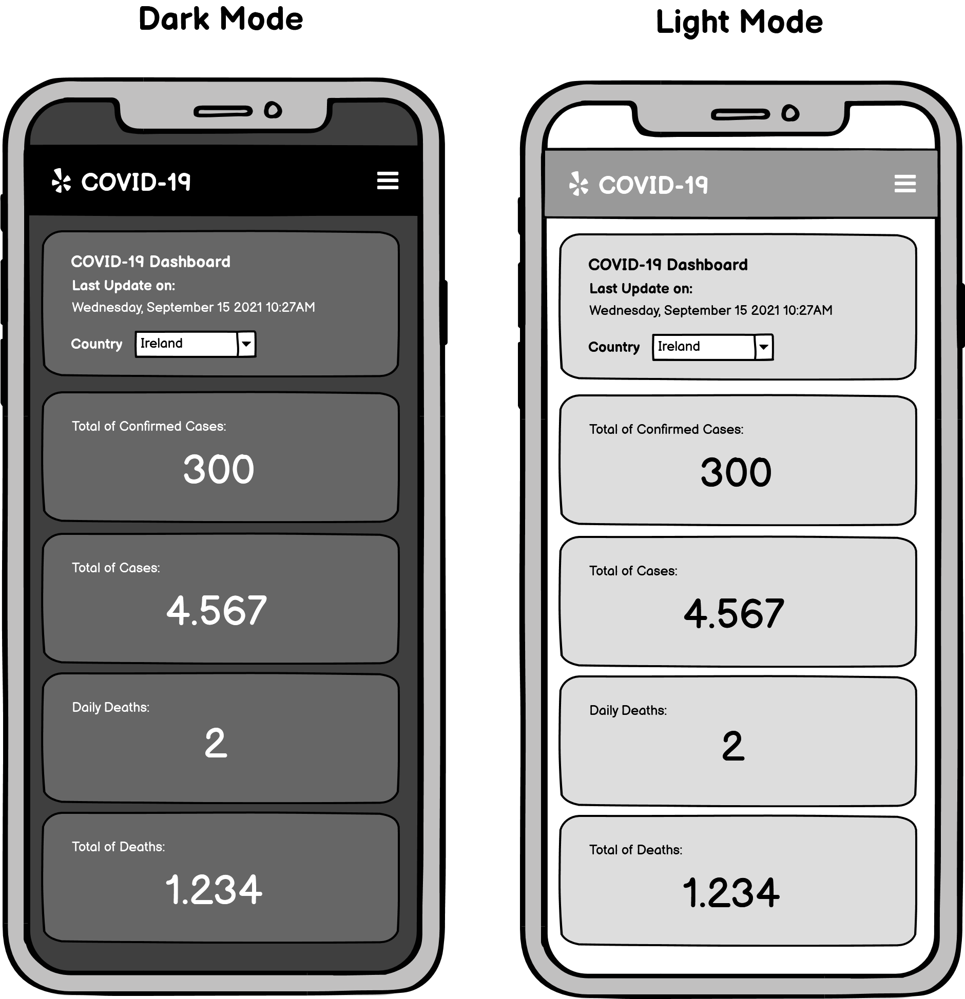
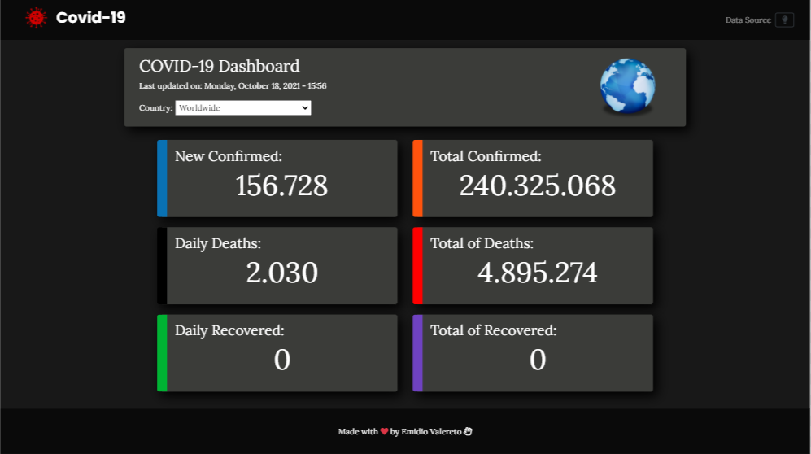
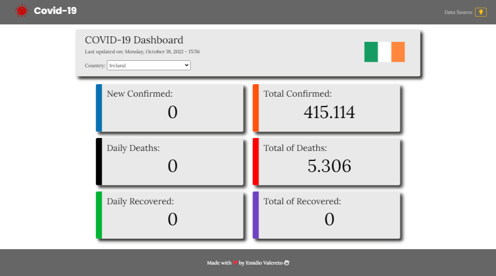
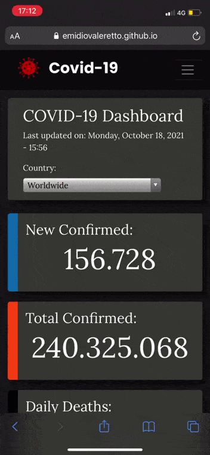
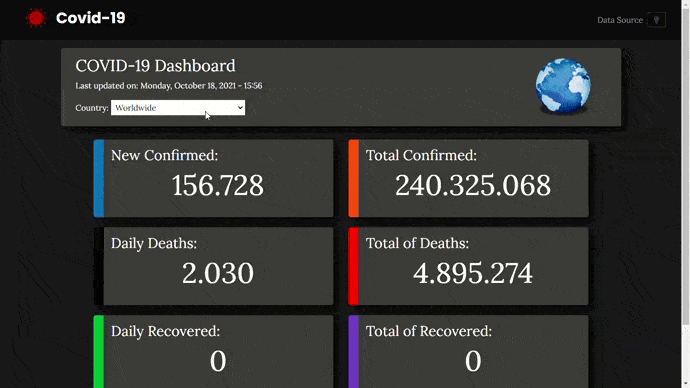
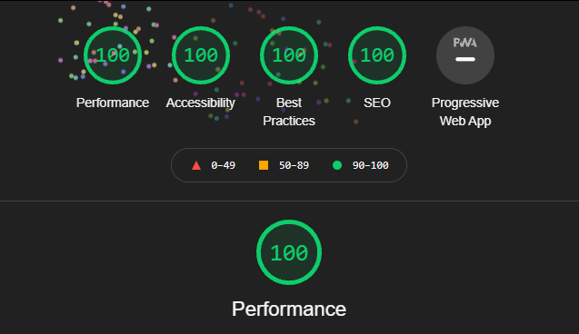

# **Coronavirus COVID-19 - Dashboard** 



The live link can be found <a href="https://emidiovaleretto.github.io/covid-19-dashboard-ms2-project/" target="_blank" rel="noopener">here</a>.


## Table of Contents
  - [Introduction](#introduction)
  - [UX](#ux)
    - [Overview](#overview)
    - [Why a COVID-19 application?](#why-a-covid-19-application)
    - [Coronavirus COVID-19 API](#coronavirus-covid-19-api)
    - [Key Project Goals](#key-project-goals)
    - [Design](#design)
      - [Wireframes](#wireframes)
      - [Design Process](#design-process)
        - [Strategy Plane](#strategy-plane)
        - [Scope Plane](#scope-plane)
        - [Structure Plane](#structure-plane)
        - [Skeleton Plane](#skeleton-plane)
        - [Surface Plane](#surface-plane)
      - [Screenshots](#screenshots)
  - [User Stories](#user-stories)
    - [Target Audience](#target-audience)
    - [As a Site User I want to...](#as-a-site-user-i-want-to)
    - [As a Developer I want to...](#as-a-developer-i-want-to)
      - [Features Visiable across the page](#features-visiable-across-the-page)
    - [Bugs and Fixes Implemented after Testing](#bugs-and-fixes-implemented-after-testing)
    - [Features left to Implement](#features-left-to-implement)
  - [Technologies Used](#technologies-used)
    - [Libraries, Frameworks and other softwares used](#libraries-frameworks-and-other-softwares-used)
    - [API's](#apis)
    - [Tools](#tools)
  - [Testing](#testing)
    - [Validation of Code Testing](#validation-of-code-testing)
      - [HTML](#html)
      - [CSS](#css)
      - [Javascript](#javascript)
    - [Accessibility and Performance Testing](#accessibility-and-performance-testing)
      - [What is considered as accessibility?](#what-is-considered-as-accessibility)
  - [Deployment](#deployment)
    - [Forking the GitHub Repository and Running this Project Locally](#forking-the-github-repository-and-running-this-project-locally)
  - [Credits](#credits)
    - [Content](#content)
    - [Media](#media)
    - [Acknowledgements](#acknowledgements)
  - [Author](#author)

## Introduction

This project was created as part of the Full Stack Software Development course offered by Code Institute.

The goal of this site is to give users the latest data about the COVID-19 disease outbreak with a only one single click. The users can find out the cases of the COVID-19 disease searching by an expecific country or can get the latest data wordwide. Hopefully this site will give everyone the source to keep themselves as up-to-date as possible regarding the pandemic of the new coronavirus.


-----

## UX

### **Overview**

COVID-19 application is an online dashboard where users can choose a specific country and get the latest COVID-19 disease information such as the total number of confirmed cases, the total number of deaths, the daily new cases and so on. Likewise, the user can choose "Worldwide" to get the latest COVID-19 disease data for all countries.


### **Why a COVID-19 application?**

The idea behind the COVID-19 dashboard project arose from the need for people to be as up-to-date as possible about the outbreak of the new coronavirus. As an Internet user, I always try to know the latest information about COVID-19 disease in my country and around the world. Thinking about that, I decided to develop this application and also because it is the most recent topic at the moment.

### **Coronavirus COVID-19 API**



This COVID-19 data source is operated by the Johns Hopkins University Center for Systems Science and Engineering team. You can find more information on https://systems.jhu.edu

The Johns Hopkins Coronavirus Resource Center (CRC) is a continually updated source of COVID-19 data and expert guidance, with collaboration from other data sources around the world.

 - Agreegated Data Sources:
   - **World Health Organization (WHO)**: https://www.who.int/
   - **European Center for Disease Prevention and Control (ECDC)**: https://www.ecdc.europa.eu/en/geographical-distribution-2019-ncov-cases/
   - **WorldoMeters**: https://www.worldometers.info/coronavirus/
   - **COVID Tracking Project**: https://covidtracking.com/data

  And many others.

  - Coronavirus COVID-19 API documentation

    - GET Default
      - <code>https://api.covid19api.com/</code>
  
```
Example Request

curl --location --request GET 'https://api.covid19api.com/'

Example Response

{
  "allRoute": 
  {
    "Name": "Get All Data",
    "Description": "Returns all data in the system. Warning: this request returns 8MB+ and takes 5+ seconds",
    "Path": "/all"
  },
  "countriesRoute": 
  {
    "Name": "Get List Of Countries",
    "Description": "Returns all countries and associated provinces. The country_slug variable is used for country specific data",
    "Path": "/countries"
  },
  "countryStatusDayOneLiveRoute": 
  {
    "Name": "Get List Of Cases Per Country Per Province By Case Type From The First Recorded Case With Live Count",
    "Description": "Returns all cases by case type for a country from the first recorded case with the latest record being the live count. Country must be the country_slug from /countries. Cases must be one of: confirmed, recovered, deaths",
    "Path": "/dayone/country/:country/status/:status/live"
  }

}

```

  - GET Summary
    - <code>https://api.covid19api.com/summary</code>

```
Example Request

curl --location --request GET 'https://api.covid19api.com/summary/

Example Response

{
  "Global": {
    "NewConfirmed": 100282,
    "TotalConfirmed": 1162857,
    "NewDeaths": 5658,
    "TotalDeaths": 63263,
    "NewRecovered": 15405,
    "TotalRecovered": 230845
  },
  "Countries": [
    {
      "Country": "ALA Aland Islands",
      "CountryCode": "AX",
      "Slug": "ala-aland-islands",
      "NewConfirmed": 0,
      "TotalConfirmed": 0,
      "NewDeaths": 0,
      "TotalDeaths": 0,
      "NewRecovered": 0,
      "TotalRecovered": 0,
      "Date": "2020-04-05T06:37:00Z"
    },
    {
      "Country": "Afghanistan",
      "CountryCode": "AF",
      "Slug": "afghanistan",
      "NewConfirmed": 18,
      "TotalConfirmed": 299,
      "NewDeaths": 1,
      "TotalDeaths": 7,
      "NewRecovered": 0,
      "TotalRecovered": 10,
      "Date": "2020-04-05T06:37:00Z"
    },
    {
      "Country": "Albania",
      "CountryCode": "AL",
      "Slug": "albania",
      "NewConfirmed": 29,
      "TotalConfirmed": 333,
      "NewDeaths": 3,
      "TotalDeaths": 20,
      "NewRecovered": 10,
      "TotalRecovered": 99,
      "Date": "2020-04-05T06:37:00Z"
    },
    {
      "Country": "Algeria",
      "CountryCode": "DZ",
      "Slug": "algeria",
      "NewConfirmed": 80,
      "TotalConfirmed": 1251,
      "NewDeaths": 25,
      "TotalDeaths": 130,
      "NewRecovered": 28,
      "TotalRecovered": 90,
      "Date": "2020-04-05T06:37:00Z"
    }
  ],
  "Date": "2020-04-05T06:37:00Z"
}  

```

For more information, please view documentation in https://documenter.getpostman.com/view/10808728/SzS8rjbc 

- Author:

**Kyle Redelinghuys** - Creator/maintainer of http://covid19api.com. 
  
[](https://twitter.com/ksredelinghuys)

### **Key Project Goals**

As a site owner, I would like to provide users with the latest data about COVID-19 disease outbreak as real as possible so that users of the site feel safe and know that the data is trustworthy.


-----

## Design

### Design Process

1. #### _Strategy Plane_
   
   **User Stories**
   This site is created based on the following user’s expectations in mind.

   * As a first time user I would like to:
     
	 * Have a clear information on what the site is about and what it provides
	 * Have an easy navigation that is consistent throughout the website
	 * Consistent layout without any confusing elements
	 * Accessibility considerations are taken throughout the site
	 * Have clear feedback for my action taken within the site 

	* As a site creator we would like :

	  * To provide a safe and user-friendly website that anyone can obtain and share information about the new coronavirus pandemic in order to meet their daily challenges in their workplace.	  

2. #### _Scope Plane_

	**Features**
	
	 * The site should be responsive and user-friendly on all browsers and devices.
	 * Intuitive and user-friendly site that any people can gain and share experiences.
	 * intuitive and user-friendly layout.
	 * The purpose of the site should be clear immediately.

3. #### _Structure Plane_

	**User Story:**

	> - As a first time visitor to the site I would like to immediately understand it's purpose.

	**Acceptance Criteria:**

	* The home page has a heading that discribes the purpose of the site and who it is for.

	**Implementation:**

	The home page will display a heading that clearly shows the site purpose.

	**Result:** User Story accomplished.

	**User Stories:**

	> - I would like to have access to the latest data regarding the outbreak of the new coronavirus.
	> - Upon the chosen the preferred country, I would like to see the results of my request as quickly as possible.
	> - I would like the application to be friendly and easy to understand and use.

	**Acceptance Criteria:**

	* User can access an up-to-date data regarding the outbreak of the new coronavirus.
	* User can easily access the list of the countries available and choose accordingly their desires and needs.
	* User can see a container for each task, such as the total number of cases or the daily deaths, which improve their experience throughout the site. 

	**Implementation:**

	There is a select field in the top right corner of the page where the user can find the list of available countries and make a choice as they desires. Afterwards, users will receive an up-to-date details regarging the country chosen. Likewise, the users have the option to choose "Worldwide" to see the data of all countries details.

	**Result:** User Story accomplished.

4. #### _Skeleton Plane_

   #### **Wireframes**

     * Here are the wireframes created in the initial planning stage.

       <details><summary>Home Page - Desktop</summary>
         
       </details>

       <details><summary>Home Page - Tablets</summary>
         
       </details>

       <details><summary>Home Page - Mobiles</summary>
         
       </details>

	**Navigation:** Select field

	* Click on the select field and scroll down to see the list of all available countries.
	* Gets the latest data about the COVID-19 disease outbreak with a only one single click.

	**Navigation:** Lightbulb icon

	* Users can choose which background color they wish to display: light or dark.
	* This feature is available on all devices, including tablets and mobile phones.

	**Features**

	*   Responsive on all device sizes.
	*   Interactive elements: background color changeable.
	*   When users choose a country, its flag is shown.

5. #### _Surface Plane_

**Colour Pallette**

* The color palette used was thought randomly, just to differentiate the containers and give a unique highlight to each. Although it was thought that way, I tried to prioritize the contrast between the elements and its colours, so that the chosen color does not interfere in the information to be transmitted.

 `#FFFFFF --white` 
 `#FF0000 --red` 
 `#B30000 --darkred`
 `#00B333 --green` 
 `#FF530D --orange` 
 `#E80C7A --pink` 
 `#0971B3 --blue` 
 `#3B3C39 --gray` 
 `#181818 --darkgray`
 `#000000 --black`

**Font**

* Google Fonts was used to import the fonts Lora & Poppins into the style.css file. These fonts were used throughout the site.

### Screenshots

<details><summary>Screenshot (Dark Mode) - Desktop</summary>
    
</details>

<details><summary>Screenshot (Light Mode) - Desktop</summary>
    
</details>

<details><summary>Screenshot (Dark Mode) - Tablet</summary>
    
</details>

<details><summary>Screenshot (Light Mode) - Tablet</summary>
    
</details>

<details><summary>Screenshot (Dark Mode) - Mobile</summary>
    
</details>

<details><summary>Screenshot (Light Mode) - Mobile</summary>
    
</details>

[Back to top ⇧](#table-of-contents)


-----

## User Stories

### Target Audience

1. My target audience is those people who want to be updated about the new coronavirus pandemic and who want to consult daily the progress of the COVID-19 outbreak around the world.

### As a Site User I want to...

1. Be able to have access to the latest data regarding the outbreak of the new coronavirus.
2. Being able to navigate the entire page without difficulties.
3. Be able to access the list of the countries available and choose accordingly my desires and needs.
4. Be able to to see the results of my request as quickly as possible.

### As a Developer I want to...

1. As I develop, I want all the features to be working as expected.
2. I want the user to have the best experience browsing the site. 
3. I want to showcase my skills in UX/UI design, HTML, CSS, JS etc.

[Back to top ⇧](#table-of-contents)


-----

### Features Visiable across the page

* Navbar: a virus image followed by a COVID-19 text logo, a link to the API Json file and a lightbulb icon where the users can interact with the background, through Javascript, changing the its color to light or dark.

<details><summary>Screenshot - Desktop</summary>
    
</details>

<details><summary>Screenshot - Mobile</summary>
    
</details>

-----

### Bugs and Fixes Implemented after Testing

#### Bugs: 

1. For some reason I cannot predict, the API is not computing the Daily Recovered and Total of Recovered.

2. Some countries have more than one single word, like United States of America or United Kingdom, so the URL takes each name with the first capital letter, e.g. <code>IE-Ireland-Flag-icon</code>. 
   1. My solution was to created a function that capitalize the first letter of each word in the variable so I can replace to the flag's URL. 
   
```
let countrySlug = toCapitalize(country[i].Slug);

const url = `https://icons.iconarchive.com/icons/wikipedia/flags/1024/${country[i].CountryCode}-${countrySlug}-Flag-icon.png`;

countryFlag.setAttribute('src', url);

countryFlag.setAttribute('alt', `${country[i].Country} Flag`);
```

* As there are some countries with more than a single word, such as the **United Kingdom** or **New Zealand** or even with three words such as **United States of America** or **Papua New Guinea**. For those countries, the variable <code>country.Slug</code> returns the country's name, however, all lowercase.
  
  * Before toCapitalize() -> <code> united-states-of-america</code>.
  * After toCapitalize() -> <code>United-States-Of-America</code>. 
  
* That way I got to solve the problem.

## ** **UPDATES** **

1. I had logged the bug above but I decided to download all country flags from the <a href="https://flagpedia.net/">Flagpedia.net</a> website and keep all images on my own directory. If the website happens to go down, I will not suffer any consequences on my application.

2. I have contacted the creator of the API to find out about the issue with the two last data: Daily Recovered and Total of Recovered. I haven't heard back from him until the submission date of this project. 

### Features left to Implement

* Text-to-Speech API. This will help many users who may struggle with reading on an electronic devices or for visually impaired users. This feature will read out what the other user has posted.
* Text Enlarger. This will enlarge text for users who may struggle with reading on electronic devices and are unable to use the text-to-speech feature. Users who having hearing problems and having poor vision can benefit from this feature as the text will become much larger.
* More options to change background color. This option will allow users with dyslexia to pick a background colour that is more suitable for them. 


[Back to top ⇧](#table-of-contents)


-----

## Technologies Used

### Languages

1. **HTML5, or Hyper Text Markup Language:** Used to construct the page within this app -   
https://developer.mozilla.org/en-US/docs/Web/HTML

2. **CSS3, or Cascading Style Sheets:** Used to style the various elements on the app's pages via coloring, fonts, spacing, etc. - 
https://www.w3.org/Style/CSS/Overview.en.html

3. **Javascript:** A programming language - https://www.javascript.com/

4. **JQuery:** A programming language - https://jquery.com/


-----

### Libraries, Frameworks and other softwares used

1. **[Font Awesome](https://fontawesome.com/)** : was used throughout all pages to add icons in order to create a better visual experience for UX purposes.

### API's

1. **COVID-19 [API](https://covid19api.com/)** : A free API for data on the Coronavirus.

### Frameworks

1. **[Bootstrap](https://getbootstrap.com/)** : was used for quickly design and customize responsive mobile-first sites.

### Other Softwares

1. **[Am I Responsive?](http://ami.responsivedesign.is/)** : was used in order to see responsive design throughout the process and to generate mockup imagery to be used.

2. **[Responsive Design Tester](https://www.responsivedesignchecker.com/)** : was used to see the responsivity throughout an array of devices (screen sizes) and resolutions. 

3. **[Wireframes](https://balsamiq.com/wireframes/)** : was used to create the mockups in the planning stage.

4. **[Flagpedia.net](https://flagpedia.net/)** : Flagpedia.net is a website that provide a source of country flags of the world. I downloaded all country flags from this website and saved it in the all-countries-flag folder on my own directory.

5. **[Tiny PNG](https://tinypng.com/)** : was used to reduce the size of the images throughout the page.


-----

### Tools

1. **Gitpod:** An online IDE also used for creating & saving code that runs in a browser, it does not have to be installed on your PC - 
https://www.gitpod.io/

2. **Git:** A version control system for tracking changes in source code during software development - https://git-scm.com/

3. **Github:** A company that provides hosting for software development version control using Git. It is a subsidiary of Microsoft - https://github

4. **Chrome DevTools:** A set of web developer tools built directly into the Google Chrome browser. I used these tools constantly thoughout the development cycle -
   https://developers.google.com/web/tools/chrome-devtools

5. **W3C Markup Validation Service:** Used to run all html and css code through a validation process looking for errors - https://validator.w3.org/
   https://jigsaw.w3.org/css-validator/validator

6. **JSHint:** Javascript Validator used to run all JS code through looking for errors - https://jshint.com/

[Back to top ⇧](#table-of-contents)


-----

## Testing


### Validation of Code Testing

#### HTML

 - Page tested using [W3C](https://validator.w3.org/nu/) HTML Validator.

#### CSS

 - Page tested using [W3C](https://jigsaw.w3.org/css-validator/) CSS Validator.

#### Javascript

- All Javascript tested using [JSHint](https://jshint.com/) Javascript Validator.

### Accessibility and Performance testing

#### What is considered as accessibility?

 - Accessibility is <strong>the practice of making your websites usable by as many people as possible</strong>.
 - We traditionally think of this as being about people with disabilities, but the practice of making sites      accessible also benefits other groups such as those using mobile devices, or those with slow network connections.
  
      - <em>Source: </em><a href="https://developer.mozilla.org/en-US/docs/Learn/Accessibility/What_is_accessibility"><b>MDN Web Docs</b></a>
  
- Accessibility and web performance are not features, they are the <strong>baseline</strong>!

<details><summary>Lighthouse Test Result</summary>
    
</details>

-----

## Deployment

This website was developed in Gitpod and pushed to the remote repository on GitHub. The live page was hosted on GitHub Pages through the following procedure: 

1. From the project's [repository](https://github.com/emidiovaleretto/covid-19-dashboard-ms2-project), go to the **Settings** tab.
2. From the left-hand menu, select the **Pages** tab.
3. Under the **Source** section, select the **Main** branch from the drop-down menu and click **Save**.
4. A message will be displayed to indicate a successful deployment to GitHub pages and provide the live link.
5. The live link can be found here - [Live Site](https://emidiovaleretto.github.io/covid-19-dashboard-ms2-project/)


### Forking the GitHub Repository and Running this Project Locally

By forking the GitHub Repository we make a copy of the original repository on our GitHub account to view and/or make changes without affecting the original 
repository by using the following steps...

1. Log in to GitHub and locate the [GitHub Repository](https://github.com/)

2. At the top of the Repository (not top of page) just above the "Settings" Button on the menu, locate the "Fork" Button.

3. You should now have a copy of the original repository in your GitHub account.

4. Run the index.html file in your local browser.

[Back to top ⇧](#table-of-contents)


-----

## Credits

### Media

- [Table of contents](https://ecotrust-canada.github.io/markdown-toc/)

- [Code Institute](https://codeinstitute.net/)

- [Font Awesome](https://fontawesome.com/)

- [Wireframes](https://balsamiq.com/wireframes/)

- [Flagpedia.net](https://flagpedia.net/)

### Acknowledgements

I would like to take the opportunity to thank:

 - My family, friends and colleagues for their advice, support and help with testing.
 - To my mentor Felipe Alarcon for his feedback, advice, support and, above all, for his patience.
 - All Code Institute Tutors and Community on Slack for the peer reviews and advice.

## Author

Made with ❤️ by <b>Emidio Valereto</b> 👋🏽 Get in touch!

[](https://www.linkedin.com/in/emidiovalereto/) [](mailto:emidio.valereto@gmail.com)

[Back to top ⇧](#table-of-contents)